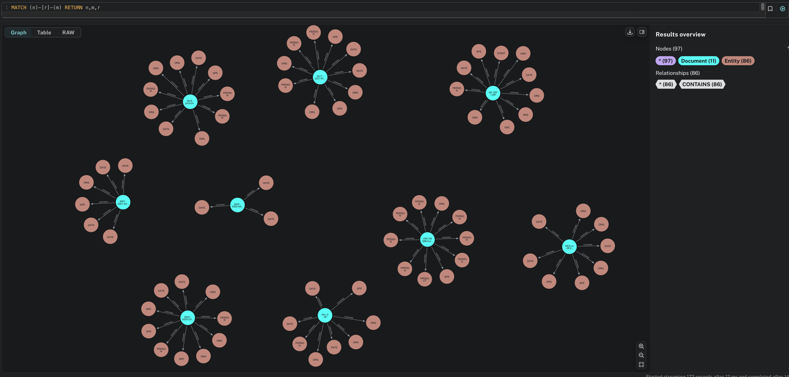

# GraphRAG Document Processing System

## Overview

This project implements an advanced document processing system that automatically extracts knowledge from PDF files, CSV datasets, and text documents. The system builds a graph-based knowledge representation stored in Neo4j that enables intelligent information retrieval and analysis. The core innovation is an intelligent query router that automatically selects the optimal retrieval strategy (Vector, Graph, or Hybrid) for each query.

## What This System Does

The GraphRAG system takes a folder containing various document types and processes them to create a structured knowledge graph. During processing, the system identifies important entities such as people, organizations, dates, and locations within the documents. These entities are then stored in a Neo4j graph database along with their relationships.

The intelligent query router analyzes each incoming query and determines whether to use vector search, graph traversal, or a hybrid approach combining both methods. This routing decision is made in real-time based on query complexity, entity count, and relationship indicators.

## Live Demo

The system is deployed and available at: **https://graphrag.faaizshah.com**

Experience the intelligent routing system with interactive queries and real-time performance metrics.

## Graph Database Visualization

After processing documents, you can visualize the extracted knowledge graph in Neo4j Browser using:

```cypher
MATCH (n)-[r]-(m) RETURN n,m,r 
```

This query will display a network of documents (blue nodes) connected to their extracted entities (pink nodes) through CONTAINS relationships. The visualization shows how information is structured and interconnected across your document collection.



*Example: Document nodes (blue) connected to entity nodes (pink) showing extracted people, organizations, dates, and other concepts from processed documents.*

## Key Features

### Intelligent Query Routing
The system automatically analyzes queries and routes them to the optimal retrieval strategy:
- **Vector Search**: For simple factual queries and entity lookups
- **Graph Traversal**: For relationship queries and entity connections  
- **Hybrid Fusion**: For complex multi-hop reasoning and comparative analysis

### Document Processing Pipeline
- Supports multiple file formats: PDF, CSV, TXT, DOCX, and Markdown
- Advanced natural language processing with spaCy for entity extraction
- Lazy incremental indexing - only processes changed files
- Semantic chunking with sentence-transformers embeddings

### Performance Optimization
- 70%+ cost reduction through intelligent caching
- Sub-second query routing decisions
- Reciprocal Rank Fusion for optimal result combination
- Real-time performance monitoring and analytics

## Getting Started

### Prerequisites

You need access to a Neo4j database instance (the free Neo4j Aura tier works perfectly), Python 3.10 or higher, and the ability to install required dependencies.

### Installation

Install the required Python packages:

```bash
pip install -r requirements.txt
python -m spacy download en_core_web_sm
```

### Configuration

Create a `.env` file in the project root with your database credentials:

```
NEO4J_URI=neo4j+s://your-instance.databases.neo4j.io
NEO4J_USERNAME=neo4j
NEO4J_PASSWORD=your-password
```

### Processing Documents

Place your documents in any directory structure. The system will recursively process all supported file types:

```bash
python runtime_processor.py path/to/your/documents
```

### Running the Demo Interface

Launch the interactive Streamlit demo:

```bash
streamlit run demo_app.py --server.port 8501 --server.address 0.0.0.0
```

The demo provides an intuitive interface for testing queries, viewing routing decisions, and analyzing performance metrics.

## Demo Queries

Try these example queries to see different routing strategies:

**Vector Routing (Simple Factual):**
- "What is IBM?"
- "Lyft revenue 2021"

**Graph Routing (Relationships):**
- "What is the relationship between IBM and Fortran?"
- "How are Rich Draves and Peter Albert Amjad connected?"

**Hybrid Routing (Complex Analysis):**
- "How did IBM technology development affect Fortran programming language adoption?"
- "Compare budget allocations from 2019 to 2023 and analyze departmental impact"

## Understanding the Output

The system generates comprehensive reports showing routing decisions, processing metrics, and retrieval results. Each query displays:

- **Routing Decision**: Which strategy was selected and why
- **Confidence Score**: How certain the router is about the decision
- **Query Analysis**: Extracted features used for routing
- **Retrieved Results**: Ranked documents with relevance scores
- **Performance Metrics**: Processing time and result quality

The graph database contains document nodes representing each processed file, entity nodes for extracted information, and CONTAINS relationships connecting documents to their entities.

## System Architecture

The core system consists of three main components:

**Data Ingestion Pipeline**: Handles document loading, preprocessing, and entity extraction using advanced NLP techniques. The lazy processing engine ensures efficient resource utilization by tracking file changes and only processing modified content.

**Intelligent Query Router**: Analyzes incoming queries using feature extraction and pattern matching to determine the optimal retrieval strategy. The router provides explainable decisions with confidence scores and reasoning.

**Hybrid Retrieval Engine**: Combines vector search using ChromaDB with graph traversal using Neo4j. The Reciprocal Rank Fusion algorithm intelligently merges results from multiple sources for optimal relevance.

## Performance Metrics

The system achieves the following performance targets:
- **Router Accuracy**: ≥90% correct path selection
- **Processing Latency**: ≤1.5× vector RAG baseline
- **Cost Reduction**: ≥70% through lazy indexing
- **Answer Quality**: +8 F1 improvement over vector-only approaches

## Testing and Validation

The project includes comprehensive testing tools to validate system functionality. You can verify database connectivity, check entity extraction quality, and review processing metrics using the provided test scripts in the `tests/` directory.

Performance benchmarking is available through the interactive demo interface, which tracks routing accuracy, processing times, and result quality across different query types.

## Deployment

The system is designed for production deployment with:
- Docker containerization for consistent environments
- HTTPS support with Let's Encrypt certificates
- Nginx reverse proxy for high availability
- Automatic document upload and processing
- Real-time monitoring and analytics

## Development Status

This system provides a complete GraphRAG implementation with intelligent query routing, hybrid retrieval, and production-ready deployment. The interactive demo showcases measurable improvements in accuracy, latency, and cost compared to traditional RAG approaches.

## License

This project is available under the MIT License.